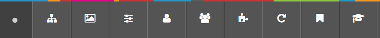

# 🧩 T4 Add Toolbar Buttons (Chrome edition)

This Chrome extension adds extra buttons to the Terminalfour (T4 v8) toolbar, just to the right of the Site Structure icon. These buttons link directly to useful features such as the **Media Library**, helping web editors work faster and more efficiently.

---

## 🚀 Features

- Adds new buttons to the T4 toolbar to the right of the Site Structure button.
- Future-ready: more buttons can be added and toggled via the options panel.
- Simple, fast, unobtrusive.

---

## 🖥️ How to use

1. **Install the extension** (see below)
2. Open Terminalfour (T4) as usual.
3. Look for new toolbar buttons next to the Site Structure icon.
4. Click any added button to open the corresponding section in T4.

---

## ⚙️ Configure your toolbar buttons

You can choose which buttons appear by visiting the extension’s **Options panel**.

### 🔧 Ways to open the options:

1. **Right-click the T4 icon** 🖱️ in the Chrome toolbar and select **Options**.
2. Select which toolbar buttons you wish to show.
3. Click Save.

> 💡 Changes take effect immediately — just refresh your T4 browser tab.

**or**

1. Go to `chrome://extensions`.
2. Find **T4 Add Toolbar Buttons**.
3. Click **Details**.
4. Click **Extension options**.
5. Select which toolbar buttons you wish to show.
6. Click Save.

> 💡 Changes take effect immediately — just refresh your T4 browser tab.

---

## 🧪 Available toolbar buttons

You can choose which of these buttons appear in the T4 toolbar by using the extension’s options panel:

- 🖼️ **Media Library** – Go to the Media Library
- ⚙️ **Media Configuration** – Go to the Media Configuration (`mediaconfig#types`)
- 👤 **User Management** – Manage user accounts in T4
- 👥 **Group Management** – Manage user groups in T4
- 🧩 **Content Type Usage** – See which content types are in use
- 🔁 **Clear the Cache** – Rebuild the T4 Cache

> Use the **Options panel** to enable or disable individual buttons.

---

## 📦 Installation in Chrome

1. Download and unzip the extension folder
2. Visit `chrome://extensions`
3. Turn on **Developer mode** (top right)
4. Click **Load unpacked**
5. Select the unzipped folder

The toolbar button should now appear in Chrome.